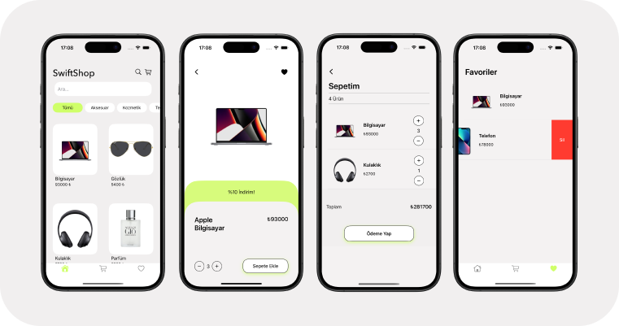

# SwiftShop App

SwiftShop is a modern e-commerce application built using UIKit and Storyboard. It provides users with a seamless shopping experience, including browsing products, adding them to favorites or cart, and viewing product details.

### Key Features

- **Storyboard-Based UI** – Clean, user-friendly interface with smooth navigation.
- **Product Detail View** – Displays product name, brand, price, image, and quantity selector.
- **Favorites System** – Users can mark products as favorites.
- **API Integration with Alamofire** – All product and cart-related operations are handled via backend APIs.

## Screenshots

